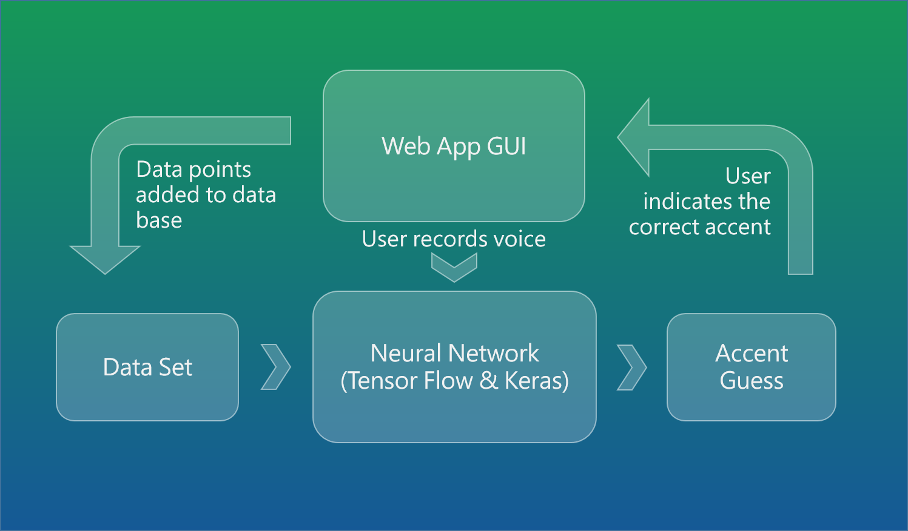

## Testing Your Fake British Accent

Based off of a dataset found from Kaggle (link below), we are training a convolutional neural network (CNN) to be able to detect the accent of a speaker reading a passage in English. Utilizing a graphical user interface (GUI), the user has the ability to record their voice and upload it to the GUI for it to be tested on the CNN, and then be able to see where the network guessed they were from. After this, the user has the option to indicate whether it was correct or not, and the CNN will be able to use these recordings as future datasets to train on.

## The Convolutional Magic of the Neural Network

There is a picture here but I can't figure out how to get it to show up online, it only works offline.

Our Accent Guesser runs on a [convolutional neural network (CNN)](https://en.wikipedia.org/wiki/Convolutional_neural_network) using [Keras](https://keras.io/) and [Tensorflow](https://www.tensorflow.org/). After training on thousands of audio recordings from the [Speech Accent Archive](http://accent.gmu.edu/), the CNN developed a system of equations which, when fed audio data, should classify it based on the accent of the speaker. The training process works by labelling each recording with its accent, processing the data by multiplying it by a system of weights, which highlight and compare different features, and gradually reduce it to one of about 200 “classes” (in this case, accents). The error from this initial guess is calculated, and the system's weights are adjusted accordingly, and then the process is repeated until a sufficient level of accuracy is reached.

This is all done in the background. As far as user interface goes, a [Flask](http://flask.pocoo.org/) based web-app acts as the front end. It records the user’s voice, then uses the CNN’s weights to guess their accent, presents that guess, and then asks for feedback. It stores their recording and correct accent in the training database to further train the accent guesser later.

## Hit Record

To use the accent guesser, just click this link and follow the onscreen instructions: [Eventually there will be a link here]

To see the code, follow the link at the top of the page and follow the instructions in the README. 

The dataset can be found [here](https://www.kaggle.com/rtatman/speech-accent-archive)

## Take a (not so) Wild Guess

Again, to see the accent guesser in action follow this link:  [Eventually there will be a link here]

Here is a video of it in action:

As well as a few graphs of its accuracy for different accents and over time.
(These will be here eventually)

## Acknowledgements

Many thanks to GitHub user drscotthawley for the usage of his [audio classifier](https://github.com/drscotthawley/panotti).
Thank you as well to Chris Wilson and Matt Diamond for the javascript providing in-browser [audio recording capabilities](https://webaudiodemos.appspot.com/AudioRecorder/index.html).
